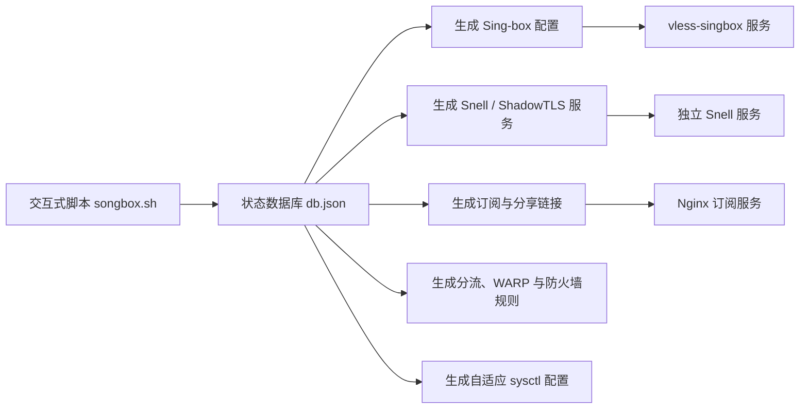

# songbox

一个面向 Linux VPS 的交互式代理服务端管理脚本。它以 Sing-box 作为统一核心，并为 Snell 保留独立服务，帮助你在同一台服务器上安装、组合和维护多种 TCP、TLS、WebSocket 与 QUIC 协议。

> 当前脚本版本：`v0.1.0`。项目需要 root 权限，会修改服务、证书、Nginx、防火墙和部分内核网络参数。请先了解变更范围，并仅用于合法、合规的网络用途。

## 项目特点

- 多协议共存：一次选择多个协议，按输入顺序完成安装。
- 统一配置：除 Snell 外的协议由一个 Sing-box 实例集中承载。
- 多实例与多用户：管理端口、凭据、启停状态、到期时间和用户出口。
- 证书管理：支持 ACME 申请、DNS API、续期、自签证书和现有证书接管。
- 客户端输出：生成分享链接、终端二维码以及 Clash/Mihomo、Surge、V2Ray 通用订阅。
- 高级分流：支持链式代理、规则分流、多 IP 出口、WARP、访问限制和 geosite/geoip 规则集。
- 中转能力：内置 Realm 管理，可将中转机端口原样转发至落地机。
- 运维能力：服务启停、日志查看、配置重建、端口级流量统计、可验证备份、失败自动回滚和脚本更新。
- 安全输入：API Token、密码、PSK、UUID、分享链接和订阅 URL 在 SSH 终端中关闭回显。
- 网络优化：根据 VPS 配置自动生成 BBR/BBR3、IPv4、IPv6 与 conntrack 调优方案。

## 工作原理



脚本把 `/etc/vless-reality/db.json` 作为配置数据源。菜单中的安装、用户、路由等操作先更新数据库，再生成 Sing-box、Snell、Nginx、iptables 和服务管理器所需的配置。Sing-box 配置生成失败时，脚本会尽量保留原配置，避免错误配置直接替换正在运行的版本。

Debian、Ubuntu、CentOS 使用 systemd 管理服务，Alpine 使用 OpenRC。配置数据库带锁更新，代理凭据、证书私钥、订阅信息和备份文件会使用私有文件权限保存。

## 支持的协议

| 类型 | 协议 |
| --- | --- |
| VLESS | REALITY、Vision、WebSocket + TLS、WebSocket 无 TLS（适合配合 CF Tunnel） |
| VMess | VMess + WebSocket + TLS |
| Trojan | Trojan、Trojan + WebSocket + TLS |
| QUIC/UDP | Hysteria2、TUIC v5 |
| 其他 Sing-box 入站 | AnyTLS、Shadowsocks 2022、传统 Shadowsocks、SOCKS5、NaïveProxy |
| ShadowTLS | Shadowsocks 2022 + ShadowTLS v3 |
| Surge/Snell | Snell v4、v5、v6 Beta，以及 Snell v4/v5 + ShadowTLS v3 |

Snell 使用独立二进制和独立服务；其余协议由 Sing-box 统一管理。传统 Shadowsocks 与 Snell 属于单用户协议，其余多数协议支持脚本内的多用户管理。

## 系统要求

- Alpine Linux、Debian、Ubuntu 或 CentOS。
- Bash `4.1` 或更高版本。
- root 权限。
- 常见架构：`x86_64/amd64`、`aarch64/arm64`；ARMv7/ARMv6 是否可用取决于对应上游组件是否提供构建。
- VPS 至少具有一个可用的公网 IPv4 或 IPv6 地址。
- 能访问 GitHub、证书颁发机构和协议组件的下载地址。
- 云厂商安全组与本机防火墙需要放行实际使用的 TCP/UDP 端口。

脚本会按发行版自动安装 `curl`、`jq`、`openssl`、`cron`、`iproute2`、`iptables`、`unzip`、DNS 工具等依赖；`qrencode` 属于可选组件。

## 快速开始

以下命令会安装必要的下载工具、从新仓库的 `main` 分支获取脚本，并立即以 root 权限运行。首次执行前，建议先阅读 `songbox.sh` 并确认脚本内容。

### Debian

```bash
sudo apt-get update && sudo apt-get install -y curl && curl -fsSL -o songbox.sh https://raw.githubusercontent.com/NeverF1ower/songbox/main/songbox.sh && chmod +x songbox.sh && sudo ./songbox.sh
```

### Ubuntu

```bash
sudo apt update && sudo apt install -y curl && curl -fsSL -o songbox.sh https://raw.githubusercontent.com/NeverF1ower/songbox/main/songbox.sh && chmod +x songbox.sh && sudo ./songbox.sh
```

### Alpine Linux

Alpine 默认不提供 Bash，以下命令请在 root 账户下执行：

```bash
apk update && apk add --no-cache bash curl && curl -fsSL -o songbox.sh https://raw.githubusercontent.com/NeverF1ower/songbox/main/songbox.sh && chmod +x songbox.sh && bash ./songbox.sh
```

首次成功安装协议后，脚本会创建快捷命令：

```bash
vless
```

基本使用流程：

1. 运行脚本，选择“安装协议”。
2. 输入一个或多个协议编号，例如 `1 8 9`。
3. 按向导设置端口、域名、证书、密码或 UUID。
4. 确认云厂商安全组已经放行对应的 TCP/UDP 端口。
5. 在“查看协议配置 / 分享链接”中获取客户端参数。
6. 如需统一下发节点，在“订阅服务管理”中启用订阅。

涉及真实 TLS 证书的协议需要正确解析到 VPS 的域名。NaïveProxy 会严格校验证书，不应使用自签证书。

## 主要管理能力

### 协议与用户

- 安装或删除指定协议，支持多个协议和端口实例共存。
- 更新 Sing-box、Snell 等核心组件。
- 添加、删除、启用或禁用用户。
- 设置用户到期日期，并通过定时任务自动禁用过期用户。
- 为用户记录流量配额并指定单独出口。

> 流量配额目前仅记录，不会自动断流；端口流量统计来自 iptables 计数器，不等同于逐用户计费。

### 证书与伪装站

- ACME HTTP/DNS 方式申请和续期证书。
- 接管已有证书，修复自动续期链路。
- 为 REALITY 配置外部握手目标或本机 HTTPS 伪装站。
- 管理证书域名、续期状态及各协议 SNI。

### 订阅与客户端配置

订阅服务由 Nginx 提供，可输出：

- Clash / Mihomo YAML
- Surge 配置
- V2Ray / 通用 Base64 订阅
- 单节点分享链接与终端二维码

订阅路径包含随机 UUID，但它本质上仍是访问凭据，请勿公开传播。

### 分流与中转

- 添加上游代理节点并配置链式代理。
- 按域名、IP、geosite、geoip 等规则选择出口。
- 配置多公网 IP 的入站与出站绑定。
- 使用 WARP 作为指定流量或默认出口。
- 设置端口访问限制并审计脚本写入的防火墙规则。
- 使用 Realm 建立中转机到落地机的 TCP/UDP 端口转发。

## BBR3、双栈与 NAT 自适应优化

主菜单第 `9` 项会先检测 VPS 能力，再展示当前值、推荐值和参数来源，不会在查看状态时直接修改系统。

检测内容包括：

- CPU 型号、物理核心、线程、频率和 AES 指令能力。
- 内存、Swap、架构与虚拟化类型。
- global IPv4/IPv6 地址及默认路由。
- 主网卡、MTU、可读取的虚拟链路速率。
- 当前拥塞控制算法、队列算法和 conntrack 使用量。

脚本按照 CPU 与内存的短板选择“微型保护、轻量代理、均衡代理、高性能代理”档位，并调整：

- `fq` 与 `bbr` 拥塞控制。
- TCP/UDP socket 缓冲区。
- `somaxconn`、SYN backlog、netdev backlog/budget。
- 本地端口范围、keepalive、MTU probing、TCP Fast Open。
- 文件句柄上限和 conntrack 容量。
- IPv4 转发、重定向保护与代理/NAT 所需的基础内核能力。

检测到 global IPv6 地址后，还会配置 IPv6 forwarding，并设置 `accept_ra=2`，避免部分依赖 SLAAC/RA 的 VPS 在开启转发后丢失 IPv6 默认路由。

需要注意：

- Linux 标准 sysctl 不提供精确的 BBR 版本号，脚本显示的 BBRv3 结果属于基于内核发行标识的推断。
- 脚本可以加载已有的 `tcp_bbr` 模块，但不会自动替换或升级 VPS 内核；内核不支持 BBR 时会停止应用并提示。
- BBR 只作用于 TCP。Hysteria2 和 TUIC 使用用户态 QUIC 拥塞控制，不会直接受益于内核 BBR。
- 网络优化只准备转发能力并调整 conntrack，不会创建或覆盖你的 DNAT、SNAT、MASQUERADE 拓扑。
- “仅补齐”会保留其他 sysctl 文件中已有的设置；“完整套用”会先备份，再通过最后加载的配置文件覆盖同名参数。

## 命令行选项

除交互菜单外，脚本还提供以下入口：

| 命令 | 功能 |
| --- | --- |
| `vless --check-expire` | 检查并禁用过期用户 |
| `vless --sync-ruleset` | 更新 geosite/geoip 规则集并重载配置 |
| `vless --regen-config` | 重新生成 Sing-box 配置并重启服务 |
| `vless --show-traffic` | 显示端口级流量统计 |
| `vless --cert-check` | 检查证书并在剩余不足 20 天时续期 |
| `vless --cert-status` | 显示证书状态和协议 SNI |
| `vless --cert-fix` | 接管现有证书并修复续期任务 |
| `vless --realm-status` | 显示 Realm 状态与转发规则 |
| `vless --firewall-status` | 审计脚本写入的防火墙规则 |
| `vless --backup [路径]` | 导出配置、用户、密钥和证书备份 |
| `vless --list-backup <文件>` | 只读查看备份中的协议、端口和用户数 |
| `vless --verify-backup <文件>` | 校验归档结构、文件类型、大小、内部清单和 `db.json` |
| `vless --restore <文件> [--only p1,p2]` | 完整或按协议恢复配置 |
| `vless --help` | 查看命令行帮助 |

备份示例：

```bash
vless --backup /root/songbox-backup.tar.gz
vless --verify-backup /root/songbox-backup.tar.gz
vless --list-backup /root/songbox-backup.tar.gz
vless --restore /root/songbox-backup.tar.gz --only vless-reality,hy2
```

新备份在发布前会调用恢复解析器自检，并写入覆盖包内全部普通文件的 `manifest.sha256`。恢复会先在临时目录完成路径、文件类型、体积、清单与 JSON 校验，再原子切换配置；新服务启动失败时自动回滚旧配置。兼容旧版的 `db.json`、`etc/db.json`、`etc/vless-reality/db.json`、外层包装目录、`root/.acme.sh` 和 `var/www/decoy` 布局。

跨机器传输时建议在可信设备另存整个备份的 SHA-256，并在恢复前传入；包内清单能发现损坏和漏文件，但不能代替外部可信哈希：

```bash
SONGBOX_RESTORE_SHA256='<64位哈希>' vless --restore /root/songbox-backup.tar.gz
```

非交互恢复还必须显式设置 `SONGBOX_RESTORE_ASSUME_YES=1`。备份包包含代理凭据、用户信息、DNS API 凭据和证书私钥，默认权限为 `600`；请及时下载到可信设备并加密保存。

## 伪装站资源

仓库的 [`assets/decoy-sites`](assets/decoy-sites) 提供三个无外部依赖的单文件模板：服务状态页、产品文档页和个人作品页。脚本直接从本仓库读取并校验 HTML，不再依赖第三方模板压缩包。你也可以先修改模板内容，再部署自己的分支。

## 重要文件

| 路径 | 用途 |
| --- | --- |
| `/etc/vless-reality/db.json` | 核心状态数据库，包含协议、实例、用户和路由参数 |
| `/etc/vless-reality/singbox.json` | 生成的 Sing-box 运行配置 |
| `/etc/vless-reality/certs/` | 证书和私钥 |
| `/etc/vless-reality/ruleset/` | geosite/geoip 规则集缓存 |
| `/usr/local/bin/sing-box` | Sing-box 二进制 |
| `/usr/local/bin/songbox.sh` | 安装后的规范管理脚本 |
| `/usr/local/bin/vless-server.sh` | 兼容旧安装的符号链接 |
| `/usr/local/bin/vless`、`/usr/bin/vless` | 管理脚本快捷命令 |
| `/var/log/vless-server.log` | 脚本运行日志 |
| `/etc/sysctl.d/99-zz-vless-tuning.conf` | 网络优化生成的 sysctl 配置 |

不要手工把 `db.json` 与生成的 `singbox.json` 分别改成不同状态。需要修改配置时优先使用菜单；如确需手工修复，完成后运行 `vless --regen-config`。

## 卸载与恢复

主菜单中的“完全卸载”会停止服务，清理脚本生成的服务单元、Nginx 配置、数据库配置和防火墙统计规则。为便于重新安装，默认会保留协议二进制和证书目录。

如果曾启用第 `9` 项网络优化，并希望恢复原有 sysctl，请先进入网络优化菜单，选择“移除本脚本写入的配置”；部分内核状态需要重启后才会完全回到默认值。

执行完全卸载或系统重装前，建议先运行：

```bash
vless --backup
```

## 安全提示与免责声明

- 不要在 Issue、截图或日志中公开 UUID、密码、PSK、私钥、订阅 URL 和备份文件。
- 自动放行端口不能替代云厂商安全组配置，也不能替代对公网暴露面的审计。
- SOCKS5 属于明文协议，建议仅监听本地地址或放在可信网络中。
- TCP Fast Open 可能带来可识别特征，部分中间设备也可能丢弃相关 SYN；出现间歇性连接失败时请关闭。
- WARP、第三方下载镜像、CDN、证书颁发机构及各协议核心均受其上游可用性和服务条款约束。
- 本项目不承诺适用于所有云厂商、内核或网络环境。修改网络和防火墙前请保留可用的 SSH/控制台恢复通道。

## 更新

可在主菜单选择“检查脚本更新”，也可以重新下载最新版 `songbox.sh`。`v0.1.0` 起规范安装路径改为 `/usr/local/bin/songbox.sh`，快捷命令仍是 `vless`。

旧 VPS 可以直接在旧版菜单中执行“检查脚本更新”：旧脚本会从原仓库地址下载新版，新版首次启动后会迁移到规范路径，并把 `/usr/local/bin/vless-server.sh` 改成兼容链接；旧文件会保留为 `.pre-songbox.bak`。新版更新器同时尝试新旧仓库地址，仓库改名期间不会中断升级链路。原有 `/etc/vless-reality` 配置和服务名保持不变。

第三方下载镜像默认关闭。只有在你确认镜像可信时才应临时设置 `ALLOW_THIRD_PARTY_MIRRORS=1`；官方发布未提供 SHA-256 时，交互模式会要求确认，非交互模式默认拒绝。

问题反馈时，请提供系统发行版、CPU 架构、内核版本、脚本版本、所用协议和脱敏后的错误日志；请务必删除所有凭据与公网订阅路径。

